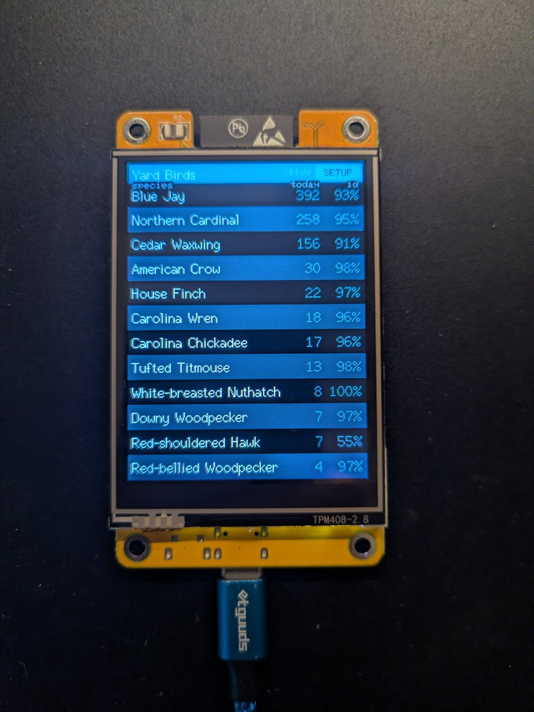
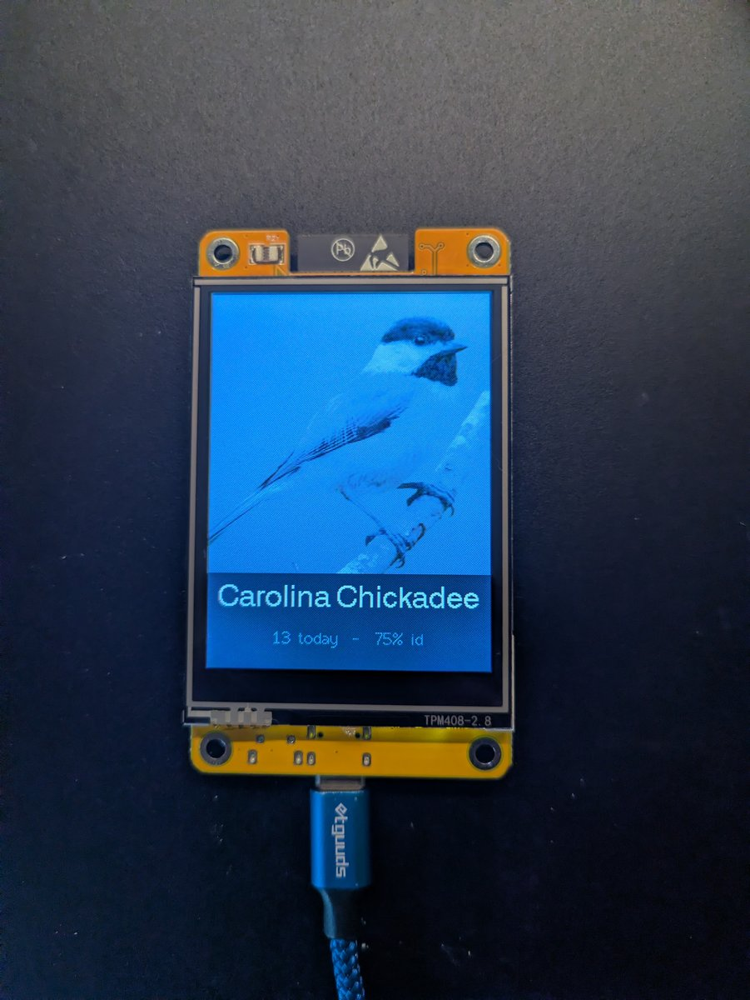
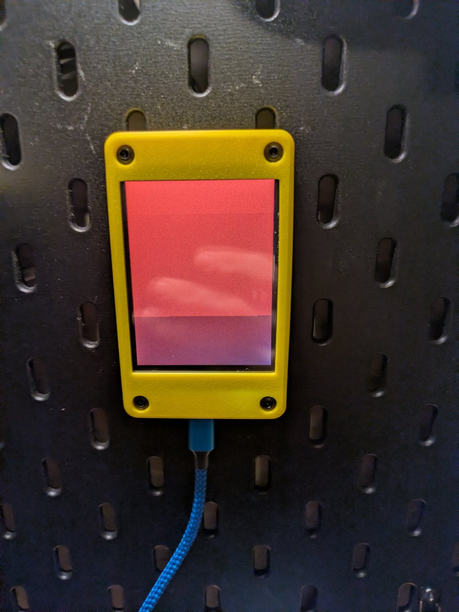
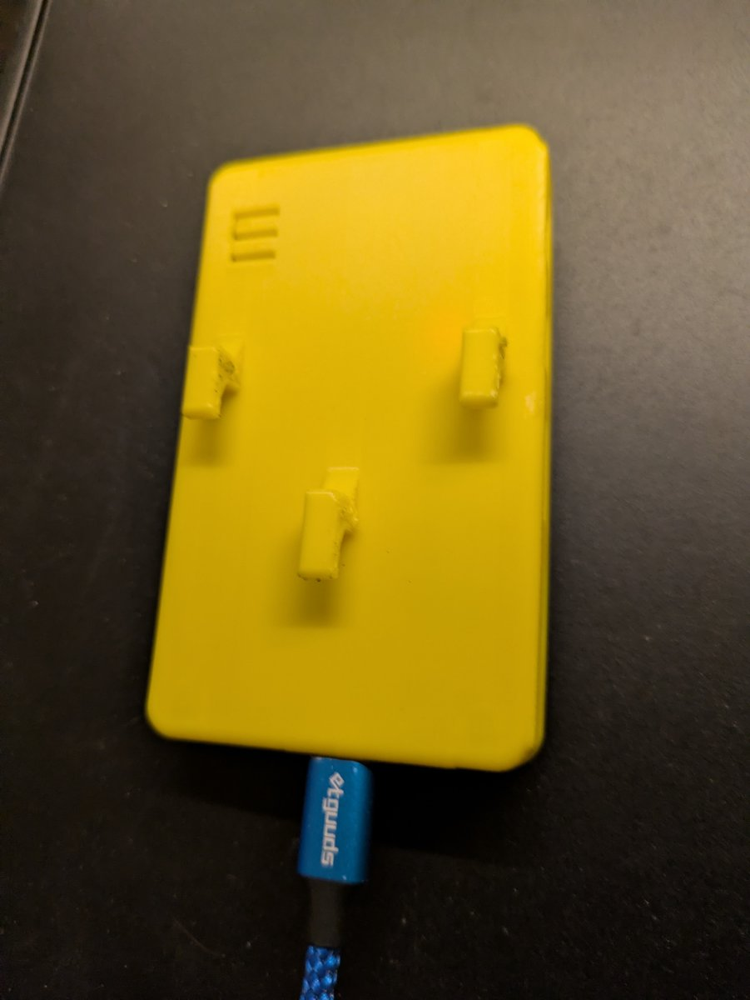

# Yard Birds — live BirdNET-Go display for the 2.8" Cheap Yellow Display

A dedicated desk display for [BirdNET-Go](https://github.com/tphakala/birdnet-go).
It shows a live list of the birds your microphone has identified today, and when a
**new** species is identified it fills the screen with that bird's photo for three
seconds before returning to the list.

**Built for the 2.8" CYD only** — the **ESP32-2432S028** ("Cheap Yellow Display"),
a ~$15 board with a 320×240 ILI9341 touchscreen and an ESP32 already attached.
That is the single supported target. This is not a general-purpose ESP32 or
display project: the pin assignments, panel driver, and touch wiring below are all
specific to this board, and the layout is tuned to a 240×320 portrait screen.

| The list | A new identification |
|:---:|:---:|
|  |  |
| Species, how many times it's been heard today, and the identification confidence. Tap **SETUP** to reconfigure. | When a **new** species is identified, the photo fills the screen for three seconds, then returns to the list. |

## Quick start

### What you need first

1. **A working BirdNET-Go instance on your network.** This project is only a
   display — it has no microphone and does no detection itself. You need
   [BirdNET-Go](https://github.com/tphakala/birdnet-go) already running,
   listening to an audio source (a microphone or an RTSP stream), and reachable
   over WiFi. Set that up first; nothing here works without it.
2. **A 2.8" CYD** — the ESP32-2432S028 board specifically.
3. **A USB data cable.** Charge-only cables are the single most common
   time-waster. If the board never shows up as a serial port, try a different
   cable before debugging anything else.
4. **PlatformIO** — either the VS Code
   [PlatformIO IDE extension](https://platformio.org/install/ide?install=vscode)
   or the CLI:

   ```bash
   pip install platformio        # or: pipx install platformio
   ```

No SD card is required.

### Steps

**1. Get the code**

```bash
git clone https://github.com/chongochingi/cyd-yard-birds
cd cyd-yard-birds
```

**2. Flash it**

```bash
pio run -e cyd -t upload
```

If the board isn't detected, it's usually the serial driver: Windows generally
needs a **CH340** driver, and on Linux your user must be in the **`dialout`**
group.

**3. First boot — things appear in this order**

| What you see | What to do |
|---|---|
| Screen flashes red → green → blue → white | Nothing — it's confirming the panel and backlight work |
| **"Touch calibration"** with a red crosshair | Tap the crosshair firmly, then the second one. Tap accuracy matters. |
| **"WiFi setup"**, and a `CYD-Birds-Setup` network appears | On your phone, join `CYD-Birds-Setup`, then open `http://192.168.4.1` |
| A setup form | Enter your WiFi, then the **BirdNET-Go host** and **port** (`8085`). Leave the auth fields blank unless your instance has `security.basicauth` enabled. |
| Tap Save | It connects and the bird list appears |

Calibration runs **before** WiFi setup, which catches people out — it happens on
first boot only and is then stored in flash.

**4. Done.** From then on it boots straight to the list — no portal, no
calibration.

For the reference detail — which setup screen appears when, reopening the portal,
and recovering from a bad calibration — see [First-time setup](#first-time-setup).

## Building and flashing

PlatformIO builds and uploads in one step:

```bash
pio run -e cyd -t upload
```

To build without uploading — for instance when the board is plugged into a
different machine than your toolchain — build here:

```bash
pio run -e cyd                # produces .pio/build/cyd/firmware.bin
```

then write the four binaries there:

```bash
esptool --chip esp32 --port /dev/ttyUSB0 --baud 921600 \
  write-flash -z --flash-mode dio --flash-freq 40m --flash-size 4MB \
  0x1000 bootloader.bin 0x8000 partitions.bin 0xe000 boot_app0.bin 0x10000 firmware.bin
```

Before writing anything, confirm the board is talking — this changes nothing:

```bash
esptool --chip esp32 --port /dev/ttyUSB0 flash-id
```

`boot_app0.bin` lives in your PlatformIO framework package, not the build output:

```
~/.platformio/packages/framework-arduinoespressif32/tools/partitions/boot_app0.bin
```

### esptool version note

esptool **v5** renamed its subcommands and flags to use hyphens (`write-flash`,
`--flash-mode`). PlatformIO still bundles **v4**, which uses underscores
(`write_flash`, `--flash_mode`).

The commands above use the v5 spelling, which also works on v4-era scripts in
reverse — v5 still accepts the underscored forms with a deprecation warning. If
you copy a command from elsewhere and it fails with *unrecognized arguments*,
that hyphen/underscore difference is almost always why.

## First-time setup

The portal collects everything in one pass — WiFi, the BirdNET-Go address, and
optional credentials (see [Quick start](#quick-start) for the walkthrough). Both
the WiFi credentials and the server address are stored in the ESP32's NVS flash,
so **this is a one-time step**. On a normal boot the portal does not appear at
all — the device connects silently and goes straight to the list.

The portal only reopens in three cases, and the screen says which:

| Screen | Meaning |
|---|---|
| `WiFi setup` | WiFi credentials are missing or wrong |
| `Server setup` | No server address has been saved yet (first-time setup) |
| `Server setup` | A saved server stayed unreachable for 30 seconds |

That last row is deliberately generous: if BirdNET-Go is briefly down or
restarting, the device retries quietly and shows `Can't reach server` on screen
rather than throwing a setup screen at an already-configured device. It only
offers setup after the grace period, which is also the recovery path if you
mistype the address.

### Reopening setup later

Tap the **SETUP** button in the top-right of the list screen. The portal opens
again with your current values pre-filled, so you can change the server address,
switch WiFi networks, or add credentials without erasing anything.

### Touch calibration

Touch drives only the SETUP button. On first boot the display runs a two-point
calibration — tap each red crosshair firmly — and stores it in NVS. Later boots
skip it.

**If you mis-tap during calibration**, the panel becomes unreliable and you
cannot tap your way out of it. Send `c` over the serial console within 2 seconds
of powering on to force a redo:

```bash
pio device monitor          # then press 'c' as it boots, or:
python3 -c "import serial,time; s=serial.Serial('/dev/ttyUSB0',115200); \
  s.setDTR(False); s.setRTS(True); time.sleep(0.2); s.setRTS(False); \
  [ (s.write(b'c'), time.sleep(0.05)) for _ in range(50) ]"
```

Clearing calibration does not touch your WiFi or server settings — they live in
separate NVS namespaces.

To start over from scratch, erase the flash first:

```bash
esptool --chip esp32 --port /dev/ttyUSB0 erase-flash
```

## Enclosure

The CYD lives in a slim, minimal [3D-printed case](https://makerworld.com/en/models/2171220-slim-minimal-case-for-esp32-cyd-2-4-2-8?from=search#profileId-2354976),
mounted on a Skadis board. The finished device sits flat on its four corner
posts:

| The finished device, mounted flat on its corner posts | Back of the enclosure — a printed plate carrying four mounting screws |
|:---:|:---:|
|  |  |

## How it works

**Data sources** (all from BirdNET-Go's HTTP API):

| Purpose | Endpoint |
|---|---|
| The list | `GET /api/v2/analytics/species/daily` — name, count today, max confidence |
| New IDs | `GET /api/v2/detections/stream` — Server-Sent Events, fires on identification |
| Photos | `GET /api/v2/media/image/<scientificName>` — 320×240 JPEG |

The list is refreshed every 5 minutes, and the SSE stream is held open
continuously. When an identification arrives, the list is re-pulled (so the count
is current) and the hero photo is shown for 3 seconds.

Repeat identifications of the same species within 45 seconds are suppressed, so
a bird calling repeatedly doesn't strobe the screen.

**No SD card.** Species photos are cached in the ESP32's internal LittleFS
partition (~896 KB = roughly 110 photos at ~8 KB each). Each species is
downloaded once and then renders instantly, including while offline.


## Configuration

Defaults live in `src/config.h` and are overridden at runtime by the setup portal:

| Setting | Default | Notes |
|---|---|---|
| `BIRDNET_DEFAULT_HOST` | `birdnet.local` | Overridden by the portal |
| `BIRDNET_DEFAULT_PORT` | `8085` | |
| `LIST_ROWS` | `12` | Rows on screen |
| `HERO_HOLD_MS` | `3000` | How long the photo stays up |
| `HERO_DEDUPE_MS` | `45000` | Suppress repeats of the same species |
| `LIST_REFRESH_MS` | `300000` | List refresh interval |

There is no API key support, because BirdNET-Go doesn't use API keys. If your
instance has `security.basicauth` enabled, enter the username and password in the
setup portal and they are sent as an HTTP Basic `Authorization` header on every
request (list, images, and the event stream). Leave the username blank to send no
header at all.

## Credits and licensing

This project is MIT licensed — see [LICENSE](LICENSE).

Bundled and depended-upon libraries:

- **TJpg_Decoder** by [Bodmer](https://github.com/Bodmer/TJpg_Decoder), wrapping
  **TJpgDec** by ChaN (R0.03, "free software ... education, research and
  commercial developments", no warranty). Vendored in `lib/` because the
  configuration differs from the upstream library default.
- **TFT_eSPI** by Bodmer — pulled via PlatformIO.
- **WiFiManager** by tzapu — MIT.
- **ArduinoJson** by Benoît Blanchon — MIT.
